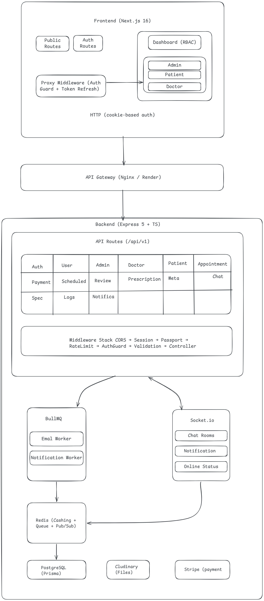

<div align="center">
  

<strong>Life Care Plus is a Full-Stack Telemedicine & Healthcare Management Platform</strong>

<a href="https://life-care-plus-mauve.vercel.app/" target="_blank" rel="noopener noreferrer">🚀 <strong>View Frontend Live</strong></a> &nbsp;|&nbsp;
<a href="https://life-care-plus.onrender.com/" target="_blank" rel="noopener noreferrer">⚡ <strong>View Backend Live</strong></a> &nbsp;|&nbsp;
<a href="https://github.com/DeveloperImran1/life-care-plus" target="_blank" rel="noopener noreferrer">💻 <strong>Source Code</strong></a>
<br><br>

  <p>
    
    
    
    
    
    
    
    
    
    
  </p>
</div>

---

## 📋 Table of Contents

- <a href="#-overview" target="_blank">Overview</a>
- <a href="#-key-features" target="_blank">Key Features</a>
- <a href="#-tech-stack" target="_blank">Tech Stack</a>
- <a href="#-system-architecture--data-flow" target="_blank">System Architecture & Data Flow</a>
- <a href="#-database-schema" target="_blank">Database Schema</a>
- <a href="#-environment-variables" target="_blank">Environment Variables</a>
- <a href="#-getting-started" target="_blank">Getting Started</a>
  - <a href="#docker-setup-one-command" target="_blank">Docker Setup (One Command)</a>
  - <a href="#manual-setup" target="_blank">Manual Setup</a>
- <a href="#-project-structure" target="_blank">Project Structure</a>
- <a href="#-api-documentation" target="_blank">API Documentation</a>
- <a href="#-authentication--authorization" target="_blank">Authentication & Authorization</a>
- <a href="#-real-time-features" target="_blank">Real-Time Features</a>
- <a href="#-payment-integration" target="_blank">Payment Integration</a>
- <a href="#-security--data-privacy" target="_blank">Security & Data Privacy</a>
- <a href="#-testing" target="_blank">Testing</a>
- <a href="#-cicd-pipeline" target="_blank">CI/CD Pipeline</a>
- <a href="#-deployment" target="_blank">Deployment</a>
- <a href="#-demo-credentials" target="_blank">Demo Credentials</a>
- <a href="#-contributing" target="_blank">Contributing</a>
- <a href="#-video-presentation" target="_blank">Video Presentation</a>

---

## 📖 Overview

**Life Care Plus** is a comprehensive healthcare management platform that connects patients with doctors through an intuitive digital experience. The platform enables online appointment scheduling, video consultations, secure payments, prescription management, and real-time communication — all within a single, role-based ecosystem.

Built with modern web technologies and following enterprise-grade architecture patterns, Life Care Plus demonstrates production-ready quality with modular design, comprehensive security measures, and full CI/CD integration.

### 🎯 Project Goal

To create a scalable, secure, and user-friendly telemedicine platform that streamlines healthcare access by digitizing the entire patient-doctor lifecycle — from registration and appointment booking to consultation, payment, and follow-up care.

---

## ✨ Key Features

### 👤 Patient

| Feature                         | Description                                                                                                    |
| ------------------------------- | -------------------------------------------------------------------------------------------------------------- |
| **User Registration**           | Sign up with email/password or Google/Facebook OAuth                                                           |
| **Doctor Discovery**            | Browse doctors by specialty with search & filters                                                              |
| **AI Doctor Suggestions**       | Get smart doctor recommendations based on input symptoms                                                       |
| **Appointment Booking**         | Book appointments with real-time schedule availability                                                         |
| **Online Payment**              | Pay via credit/debit card through Stripe (pay now or later)                                                    |
| **Video Consultation**          | Join video calls directly in the browser (Daily.co)                                                            |
| **Prescription Access**         | View digital prescriptions from appointments                                                                   |
| **Doctor Reviews**              | Rate and review doctors after appointments                                                                     |
| **Real-Time Chat**              | Message doctors with typing indicators & reactions                                                             |
| **Video Consultation**          | WebRTC-based video calls via Daily.co with screen sharing                                                      |
| **Smart Notifications**         | Multi-channel: in-app (Socket.io), email (Nodemailer), SMS (Twilio), browser push (Web Push API)               |
| **Redis Caching & Performance** | Frequently accessed data cached in Redis — faster page loads, reduced DB queries, optimized API response times |

### 👨‍⚕️ Doctor

| Feature                   | Description                                            |
| ------------------------- | ------------------------------------------------------ |
| **Profile Management**    | Manage professional details, specialties, and fees     |
| **Schedule Management**   | Set and manage available time slots                    |
| **Appointment Dashboard** | View upcoming, in-progress, and completed appointments |
| **Video Consultation**    | Initiate and join video calls with patients            |
| **Prescription Writing**  | Generate digital prescriptions post-consultation       |
| **Patient Chat**          | Real-time messaging with patients                      |
| **Dashboard Analytics**   | View performance metrics and earnings data             |
| **Notifications**         | Appointment reminders and status updates               |

### 🔐 Admin

| Feature                   | Description                                       |
| ------------------------- | ------------------------------------------------- |
| **User Management**       | CRUD operations for admins, doctors, and patients |
| **Schedule Management**   | Create and manage system-wide schedules           |
| **Appointment Oversight** | Monitor and manage all appointments               |
| **Payment Tracking**      | View complete payment history                     |
| **Content Management**    | Manage specialties and system metadata            |
| **Logs & Monitoring**     | Access system logs and error tracking             |
| **Role-Based Access**     | SUPER_ADMIN has full control over the system      |
| **Dashboard Analytics**   | Comprehensive system-wide statistics              |

---

## 🛠 Tech Stack

### Frontend (`client/`)

| Technology           | Purpose                                                           |
| -------------------- | ----------------------------------------------------------------- |
| **Next.js 16**       | React framework with App Router, server components, and Turbopack |
| **React 19**         | UI library with Actions, useActionState, and transitions          |
| **TypeScript 5**     | Static type checking                                              |
| **Tailwind CSS 4**   | Utility-first CSS framework with @tailwindcss/postcss             |
| **shadcn/ui**        | Accessible, reusable UI components built on Radix primitives      |
| **Zod 4**            | Schema validation (shared patterns with backend)                  |
| **Jotai**            | Lightweight state management for cross-component state            |
| **Daily.co**         | Browser-based video conferencing SDK                              |
| **Socket.io Client** | Real-time bi-directional communication                            |
| **Jest 30**          | Unit & integration testing with React Testing Library             |
| **Lucide React**     | Icon library                                                      |
| **Recharts**         | Data visualization for dashboard analytics                        |

### Backend (`server/`)

| Technology        | Purpose                                                         |
| ----------------- | --------------------------------------------------------------- |
| **Express 5**     | HTTP server framework with improved async error handling        |
| **TypeScript 5**  | Static type checking                                            |
| **Prisma 7**      | ORM with PostgreSQL adapter and connection pooling              |
| **PostgreSQL 16** | Primary relational database                                     |
| **Redis 7**       | In-memory data store for caching, BullMQ, and Socket.io pub/sub |
| **Socket.io 4**   | WebSocket server for real-time features                         |
| **BullMQ**        | Background job processing for email & notifications             |
| **Passport.js**   | Authentication strategies (Google OAuth, Facebook OAuth)        |
| **Stripe**        | Payment processing with webhook integration                     |
| **Cloudinary**    | Media file storage and optimization                             |
| **Winston**       | Structured logging with daily rotation                          |
| **Morgan**        | HTTP request logging middleware                                 |
| **Sentry**        | Error tracking and performance monitoring                       |
| **Nodemailer**    | Email delivery via Gmail SMTP                                   |
| **Twilio**        | SMS notifications for appointment reminders                     |
| **Web Push**      | Browser push notification support                               |
| **Zod 4**         | Request validation                                              |
| **Jest 30**       | Integration testing with Supertest                              |
| **node-cron**     | Scheduled job execution                                         |

---

## 🏗 System Architecture & Data Flow

<div align="center">
  <a href="./doc/Architecture.png" target="_blank">
    
  </a>
  <p><em>Click to view full-size in a new tab.</em></p>
</div>

### Data Flow

<div align="center">
  <a href="./doc/Data%20Flow.png" target="_blank">
    
  </a>
  <p><em>Click to view full-size in a new tab.</em></p>
</div>

**Flow breakdown:**

1. **Browser** sends request → **Next.js** renders or proxies to API
2. **proxy.ts** middleware verifies JWT from HTTP-only cookie, auto-refreshes if expired, redirects if unauthorized
3. **Express server** receives request → applies middleware stack (CORS, rate limit, auth guard, Zod validation)
4. **Controller** receives validated data → delegates to **Service** layer
5. **Service** executes business logic → queries database via **Prisma** ORM, caches in **Redis**, emits events via **Socket.io**, enqueues background jobs via **BullMQ**
6. **Response** flows back through the chain as a unified `sendResponse` envelope

### Key Architectural Decisions

| Decision                              | Rationale                                                                                                                                              |
| ------------------------------------- | ------------------------------------------------------------------------------------------------------------------------------------------------------ |
| **Modular monolith backend**          | Each feature is a self-contained module (route → controller → service → validation). Simple to reason about, easy to extract into microservices later. |
| **Proxy-as-middleware**               | Auth logic lives in `proxy.ts` (not `middleware.ts`), keeping route protection centralized and testable.                                               |
| **Prisma schema as directory**        | Split across domain files for maintainability; single `prisma.config.ts` for tooling compatibility.                                                    |
| **Redis for queue + pub/sub**         | Single Redis instance serves BullMQ, Socket.io adapter, caching, and social login OTP — reducing operational overhead.                                 |
| **Cookie-based JWT**                  | HTTP-only cookies prevent XSS token theft; auto-refresh mechanism in proxy maintains session seamlessly.                                               |
| **Stripe webhook before JSON parser** | Raw body required for signature verification; registered before `express.json()` in the middleware stack.                                              |
| **Polymorphic User model**            | Shared `User` base with role-specific profiles (Admin, Doctor, Patient) via email FK — avoids complex inheritance.                                     |

---

## 🔧 Environment Variables

### Server (`server/.env`)

| Variable                      | Description                   | Required          | Default                                |
| ----------------------------- | ----------------------------- | ----------------- | -------------------------------------- |
| `NODE_ENV`                    | Environment mode              | ✅                | `development`                          |
| `PORT`                        | Server port                   | ✅                | `5000`                                 |
| `DATABASE_URL`                | PostgreSQL connection string  | ✅                | —                                      |
| `JWT_SECRET`                  | Access token signing key      | ✅                | —                                      |
| `REFRESH_TOKEN_SECRET`        | Refresh token signing key     | ✅                | —                                      |
| `EXPIRES_IN`                  | Access token TTL              | ✅                | `7d`                                   |
| `REFRESH_TOKEN_EXPIRES_IN`    | Refresh token TTL             | ✅                | `1y`                                   |
| `RESET_PASS_TOKEN`            | Reset password token secret   | ✅                | —                                      |
| `RESET_PASS_TOKEN_EXPIRES_IN` | Reset token TTL               | ✅                | `5m`                                   |
| `RESET_PASS_LINK`             | Frontend reset password URL   | ✅                | `http://localhost:3000/reset-password` |
| `SALT_ROUND`                  | bcrypt salt rounds            | ✅                | `10`                                   |
| `EMAIL`                       | Gmail address for SMTP        | ✅                | —                                      |
| `APP_PASS`                    | Gmail app password            | ✅                | —                                      |
| `GOOGLE_CLIENT_ID`            | Google OAuth client ID        | ⚠️ (social login) | —                                      |
| `GOOGLE_CLIENT_SECRET`        | Google OAuth client secret    | ⚠️                | —                                      |
| `FACEBOOK_APP_ID`             | Facebook OAuth app ID         | ⚠️                | —                                      |
| `FACEBOOK_APP_SECRET`         | Facebook OAuth app secret     | ⚠️                | —                                      |
| `STRIPE_SECRET_KEY`           | Stripe secret key             | ⚠️ (payments)     | —                                      |
| `STRIPE_WEBHOOK_SECRET`       | Stripe webhook signing secret | ⚠️                | —                                      |
| `CLOUDINARY_CLOUD_NAME`       | Cloudinary cloud name         | ⚠️ (file upload)  | —                                      |
| `CLOUDINARY_API_KEY`          | Cloudinary API key            | ⚠️                | —                                      |
| `CLOUDINARY_API_SECRET`       | Cloudinary API secret         | ⚠️                | —                                      |
| `FRONTEND_URL`                | Frontend origin for CORS      | ✅                | `http://localhost:3000`                |
| `LOG_LEVEL`                   | Winston log level             | ✅                | `info`                                 |
| `RATE_LIMIT_WINDOW_MS`        | Rate limit window (ms)        | ✅                | `900000`                               |
| `RATE_LIMIT_MAX_REQUESTS`     | Max requests per window       | ✅                | `100`                                  |

> A complete `.env.example` is available at `server/.env.example` — copy it to `server/.env` and fill in your values.

### Client (`client/.env.local`)

| Variable                   | Description                                                           |
| -------------------------- | --------------------------------------------------------------------- |
| `NEXT_PUBLIC_SOCKET_URL`   | Socket.io server URL (default: `http://localhost:5000`)               |
| `JWT_SECRET`               | Must match server's `JWT_SECRET` for token verification in middleware |
| `NEXT_PUBLIC_DAILY_DOMAIN` | Daily.co domain (default: `life-care-plus`)                           |

---

## 🚀 Getting Started

### Prerequisites

- **Node.js** ≥ 20
- **npm** ≥ 9
- **Docker Desktop** (for PostgreSQL + Redis)
- **Stripe CLI** (for webhook testing, optional)

---

### Docker Setup (One Command)

```bash
# Clone the repository
git clone https://github.com/DeveloperImran1/life-care-plus.git
cd life-care-plus

# Start everything — PostgreSQL, Redis, and Backend
docker compose up -d
```

This single command starts:

- **PostgreSQL 16** on port `5433`
- **Redis 7** on port `6380`
- **Backend server** on port `5000` (with hot-reload via volume mount)

> The frontend service is commented out in `docker-compose.yml` — run it locally with `npm run dev` for the best development experience.

After Docker is running, set up environment variables (see below), then start the frontend:

```bash
cd client
npm install
npm run dev
```

---

### Manual Setup

#### 1️⃣ Clone & Install

```bash
git clone https://github.com/DeveloperImran1/life-care-plus.git
cd life-care-plus

# Install server dependencies
cd server
npm install

# Install client dependencies
cd ../client
npm install --legacy-peer-deps
```

#### 2️⃣ Start Infrastructure (Docker)

```bash
# From the root directory
docker compose up -d db redis
```

#### 3️⃣ Configure Environment

Copy and fill in the environment files as described in the <a href="#-environment-variables" target="_blank">Environment Variables</a> section above.

#### 4️⃣ Database Setup

```bash
cd server

# Generate Prisma client
npm run prisma:generate

# Run migrations
npm run prisma:migrate:dev
```

> The super admin is auto-seeded on first server start — no manual seed command needed.

#### 5️⃣ Start Development Servers

```bash
# Terminal 1 — Server (port 5000)
cd server
npm run dev

# Terminal 2 — Client (port 3000)
cd client
npm run dev
```

#### 6️⃣ (Optional) Stripe Webhook Forwarding

```bash
cd server
npm run stripe:webhook
```

---

## 📁 Project Structure

```
life-care-plus/
├── client/                          # Next.js 16 Frontend
│   ├── src/
│   │   ├── app/                     # App Router pages
│   │   │   ├── (auth)/              # Login, Register, Forgot Password
│   │   │   ├── (dashboard)/         # Admin, Doctor, Patient dashboards
│   │   │   └── (public)/            # Home, About, Contact
│   │   ├── components/              # Reusable React components
│   │   │   ├── modules/Admin/       # Admin CRUD page components
│   │   │   ├── ui/                  # shadcn/ui primitives
│   │   │   └── shared/              # ManagementTable, Filters, etc.
│   │   ├── hooks/                   # Custom React hooks
│   │   ├── lib/                     # Utilities (server-fetch, validators)
│   │   ├── services/                # API layer (http.ts, admin server actions)
│   │   ├── contexts/                # React contexts (Socket, Auth)
│   │   ├── types/                   # TypeScript interfaces
│   │   └── proxy.ts                 # Next.js middleware (auth guard)
│   ├── __tests__/                   # Jest test files
│   ├── jest.config.ts
│   └── package.json
│
├── server/                          # Express 5 Backend
│   ├── prisma/
│   │   └── schema/                  # Split schema files by domain
│   │       ├── schema.prisma        # Generator & datasource
│   │       ├── enums.prisma         # Shared enums
│   │       ├── user.prisma          # User, Admin, Doctor, Patient
│   │       ├── appointment.prisma   # Appointment, Payment, Prescription
│   │       ├── chat.prisma          # Conversation, Message
│   │       ├── notification.prisma  # Notification, PushSubscription
│   │       └── ...                  # schedule, specialty, etc.
│   ├── src/
│   │   ├── app.ts                   # Express app setup
│   │   ├── server.ts                # Entry point (seeds, bootstrap)
│   │   ├── app/
│   │   │   ├── modules/             # 16 feature modules
│   │   │   │   ├── auth/            # Authentication & social login
│   │   │   │   ├── appointment/     # Appointment booking & cron
│   │   │   │   ├── payment/         # Stripe payment processing
│   │   │   │   ├── chat/            # Real-time messaging
│   │   │   │   ├── doctor/          # Doctor profiles
│   │   │   │   ├── patient/         # Patient profiles
│   │   │   │   ├── admin/           # Admin management
│   │   │   │   ├── schedule/        # Schedule CRUD
│   │   │   │   ├── doctorSchedule/  # Doctor schedule slots
│   │   │   │   ├── prescription/    # Digital prescriptions
│   │   │   │   ├── review/          # Doctor ratings & reviews
│   │   │   │   ├── specialties/     # Medical specialties
│   │   │   │   ├── notification/    # In-app notifications
│   │   │   │   ├── meta/            # Dashboard analytics
│   │   │   │   ├── log/             # System log viewer
│   │   │   │   └── user/            # User CRUD & status
│   │   │   ├── middlewares/         # Auth, rate-limit, error handler
│   │   │   ├── jobs/               # BullMQ queues & workers
│   │   │   └── routes/index.ts     # Route aggregator
│   │   ├── socket/
│   │   │   └── socket.server.ts    # Socket.io setup & events
│   │   ├── config/                 # Passport strategies, env config
│   │   ├── helpers/                # JWT, file upload, Daily.co, seed
│   │   ├── lib/                    # Logger, Redis, Stripe, Prisma
│   │   └── shared/                 # catchAsync, sendResponse, pick
│   ├── logs/                       # Winston log files (gitignored)
│   ├── uploads/                    # Multer temporary files (gitignored)
│   ├── logs-cli.sh                 # Log management shell script
│   ├── prisma.config.ts            # Prisma 7 configuration
│   ├── vercel.json                 # Vercel deployment config
│   └── Dockerfile                  # Multi-stage production build
│
├── doc/                            # Architecture & design docs
├── docker-compose.yml              # PostgreSQL, Redis, Backend services
├── AGENTS.md                       # LLM agent instructions
├── README.md                       # This file
└── server/life-care-plus-API-updated.postman_collection.json  # Postman API collection
```

---

## 📚 API Documentation

All API endpoints are prefixed with `/api/v1`. A fully-documented Postman collection is included in the repository for testing all endpoints:

```bash
# Import into Postman:
server/life-care-plus-API-updated.postman_collection.json
```

<a href="server/life-care-plus-API-updated.postman_collection.json" target="_blank" rel="noopener noreferrer">
  
</a>

The collection includes pre-configured requests for every module with environment variables for base URL and authentication tokens.

### Authentication (`/auth`)

| Method | Endpoint                | Auth         | Description                   |
| ------ | ----------------------- | ------------ | ----------------------------- |
| POST   | `/auth/login`           | Rate-limited | Email + password login        |
| POST   | `/auth/refresh-token`   | Cookie       | Refresh access token          |
| POST   | `/auth/change-password` | All roles    | Change password               |
| POST   | `/auth/forgot-password` | -            | Send reset email              |
| POST   | `/auth/reset-password`  | Mixed        | Reset password                |
| GET    | `/auth/me`              | -            | Get current user profile      |
| GET    | `/auth/google`          | -            | Google OAuth redirect         |
| GET    | `/auth/facebook`        | -            | Facebook OAuth redirect       |
| POST   | `/auth/exchange-code`   | -            | Exchange OAuth OTP for tokens |
| POST   | `/auth/logout`          | Cookie       | Logout & blacklist token      |

### User Management (`/user`)

| Method | Endpoint                  | Auth               | Description            |
| ------ | ------------------------- | ------------------ | ---------------------- |
| GET    | `/user`                   | SUPER_ADMIN, ADMIN | List users             |
| GET    | `/user/me`                | All roles          | Get own profile        |
| POST   | `/user/create-admin`      | SUPER_ADMIN, ADMIN | Create admin           |
| POST   | `/user/create-doctor`     | SUPER_ADMIN, ADMIN | Create doctor          |
| POST   | `/user/create-patient`    | Public             | Register patient       |
| PATCH  | `/user/:id/status`        | SUPER_ADMIN, ADMIN | Change user status     |
| PATCH  | `/user/update-my-profile` | All roles          | Update own profile     |
| POST   | `/user/push-subscription` | All roles          | Save push subscription |

### Doctor (`/doctor`)

| Method | Endpoint             | Auth          | Description                   |
| ------ | -------------------- | ------------- | ----------------------------- |
| GET    | `/doctor`            | Public        | List doctors (search, filter) |
| GET    | `/doctor/:id`        | Public        | Get doctor details            |
| POST   | `/doctor/suggestion` | Public        | AI-powered doctor suggestion  |
| PATCH  | `/doctor/:id`        | ADMIN, DOCTOR | Update doctor                 |
| DELETE | `/doctor/:id`        | ADMIN         | Hard delete                   |
| DELETE | `/doctor/soft/:id`   | ADMIN         | Soft delete                   |

### Appointment (`/appointment`)

| Method | Endpoint                            | Auth               | Description                |
| ------ | ----------------------------------- | ------------------ | -------------------------- |
| GET    | `/appointment`                      | SUPER_ADMIN, ADMIN | List all appointments      |
| GET    | `/appointment/my-appointment`       | PATIENT, DOCTOR    | My appointments            |
| POST   | `/appointment`                      | PATIENT            | Book (pay now)             |
| POST   | `/appointment/pay-later`            | PATIENT            | Book (pay later)           |
| POST   | `/appointment/:id/initiate-payment` | PATIENT            | Pay for unpaid appointment |
| PATCH  | `/appointment/status/:id`           | ADMIN, DOCTOR      | Update status              |

### Payment (`/payment`)

| Method | Endpoint                         | Auth               | Description                      |
| ------ | -------------------------------- | ------------------ | -------------------------------- |
| GET    | `/payment`                       | SUPER_ADMIN, ADMIN | List payments                    |
| GET    | `/payment/:id`                   | SUPER_ADMIN, ADMIN | Get payment                      |
| GET    | `/payment/status/:appointmentId` | All roles          | Payment status                   |
| POST   | `/webhook`                       | Stripe signature   | Stripe webhook (outside /api/v1) |

### Additional Modules

Full endpoints for **Schedule**, **Doctor Schedule**, **Specialties**, **Prescription**, **Review**, **Chat**, **Notification**, **Meta**, **Logs**, and **Patient** modules are available in the project. See Postman collection for complete documentation.

---

## 🔐 Authentication & Authorization

### Flow Diagram

<div align="center">
  <a href="doc/Auth API Flow.png" target="_blank" rel="noopener noreferrer">
    
  </a>
  <br /><br />
  <a href="doc/Auth API Request Pipilene.png" target="_blank" rel="noopener noreferrer">
    
  </a>
</div>

> Click on either diagram to view it full-size in a new tab.

### Authentication Methods

| Method                   | Description                                                  |
| ------------------------ | ------------------------------------------------------------ |
| **Email & Password**     | bcrypt-hashed passwords with rate limiting & account lockout |
| **Google OAuth**         | Passport strategy with profile auto-creation                 |
| **Facebook OAuth**       | Passport strategy with double-submit prevention              |
| **JWT Access Token**     | Short-lived (7d default), stored in HTTP-only cookie         |
| **JWT Refresh Token**    | Long-lived (1y), used for silent rotation via proxy          |
| **Reset Password Token** | Short-lived (5min), emailed to user                          |

### Role-Based Access Control

Three roles with hierarchical permissions:

| Role            | Access                                                    |
| --------------- | --------------------------------------------------------- |
| **SUPER_ADMIN** | Full system access — manage admins, view all data, delete |
| **ADMIN**       | Most admin operations except admin management             |
| **DOCTOR**      | Own profile, schedules, appointments, prescriptions, chat |
| **PATIENT**     | Own appointments, prescriptions, reviews, chat            |

Access is enforced at two levels:

1. **Proxy Middleware** (`proxy.ts`) — Route-level redirect based on role
2. **Auth Middleware** (`auth.ts`) — API-level guard checking JWT role

---

## 🗄 Database Schema

### Entity-Relationship Overview

> 📄 The complete ERD is available as a **PDF** (drawn with draw.io). Click below to view it in a new tab:

<div align="center">
  <a href="doc/ph-health-care-erd2.drawio.pdf" target="_blank" rel="noopener noreferrer">
    
  </a>
</div>

### Key Models

| Model              | Table              | Description                                           |
| ------------------ | ------------------ | ----------------------------------------------------- |
| **User**           | `users`            | Central identity with email, role, status             |
| **Admin**          | `admins`           | Admin profile (FK via email)                          |
| **Doctor**         | `doctors`          | Doctor profile with fee, rating, specialties          |
| **Patient**        | `patients`         | Patient profile with health data & medical reports    |
| **Appointment**    | `appointments`     | Core booking entity linking patient, doctor, schedule |
| **Payment**        | `payments`         | Stripe payment with transaction tracking              |
| **Prescription**   | `prescriptions`    | Digital prescription per appointment                  |
| **Schedule**       | `schedules`        | System-wide time slots                                |
| **DoctorSchedule** | `doctor_schedules` | Doctor-specific slot with booking status              |
| **Message**        | `messages`         | Chat messages with reactions, seen status             |
| **Notification**   | `notifications`    | In-app notifications per user                         |

---

## 💬 Real-Time Features

### Socket.io Events

| Event                          | Direction       | Purpose                       |
| ------------------------------ | --------------- | ----------------------------- |
| `send_message`                 | Client → Server | Send chat message             |
| `receive_message`              | Server → Client | Incoming message              |
| `typing`                       | Client → Server | Typing indicator              |
| `user_typing`                  | Server → Client | Broadcast typing              |
| `doctor_joined_call`           | Client → Server | Notify patient for video call |
| `notification`                 | Server → Client | Real-time notifications       |
| `user:online` / `user:offline` | Server ↔ Client | Presence tracking             |

### Video Consultation (Daily.co)

- WebRTC-based video calls powered by Daily.co
- Room auto-created on payment success
- Features: toggle video/audio, screen sharing, participant management
- 2-participant limit per room (doctor + patient)
- Socket.io event `doctor_joined_call` triggers patient notification

### Background Jobs (BullMQ)

| Queue                     | Worker              | Purpose                                |
| ------------------------- | ------------------- | -------------------------------------- |
| `email-dispatch-queue`    | Email worker        | Send transactional emails (nodemailer) |
| `role-notification-queue` | Notification worker | Fan-out notifications to user roles    |

### Cron Jobs

| Task                       | Schedule        | Description                                      |
| -------------------------- | --------------- | ------------------------------------------------ |
| Cancel unpaid appointments | Every 5 minutes | Frees booked schedules, deletes related payments |
| Clean expired tokens       | Daily 3:00 AM   | Removes expired blacklisted JWTs                 |
| Clean login attempts       | Daily 3:30 AM   | Removes attempts older than 7 days               |
| Appointment reminders      | Every minute    | SMS reminders via Twilio (for active testing)    |

---

## 💳 Payment Integration

### Stripe Checkout Flow

```
Patient clicks "Pay Now"
         │
         ▼
Create Appointment + Payment record (DB transaction)
         │
         ▼
Create Stripe Checkout Session (amount = appointmentFee)
         │
         ▼
Redirect to Stripe Checkout page
         │
         ▼
User completes payment on Stripe
         │
         ▼
Stripe sends webhook to POST /webhook
         │
         ▼
Verify signature with STRIPE_WEBHOOK_SECRET
         │
         ▼
checkout.session.completed event
         │
         ├──▶ Update payment status → PAID
         ├──▶ Update appointment → PAID
         ├──▶ Create Daily.co video room
         ├──▶ Emit notification (Socket.io + DB)
         └──▶ Invalidate Redis caches
```

### Features

- **Pay Now** — Book and pay in one step
- **Pay Later** — Book with 30-minute grace period (auto-cancel via cron)
- **Stripe Webhook** — Signature verification + idempotency via `stripeEventId`
- **Mock Success** — `GET /payment/mock-success` for local testing
- **Currency** — BDT (Bangladeshi Taka), amount = fee × 100

---

## 🛡 Security & Data Privacy

### Implemented Measures

| Category               | Measures                                                                                                   |
| ---------------------- | ---------------------------------------------------------------------------------------------------------- |
| **Authentication**     | bcrypt password hashing, JWT (HS256), HTTP-only cookies, refresh token rotation                            |
| **Authorization**      | Role-based middleware (SUPER_ADMIN / ADMIN / DOCTOR / PATIENT), route-level guards, proxy-level redirects  |
| **Rate Limiting**      | Global (100/15min), Login (5/15min), Payment (10/hour) — per IP address                                    |
| **Account Lockout**    | Max 5 failed login attempts in 30 minutes; successful login resets the counter                             |
| **Token Blacklisting** | On logout, refresh token is stored in `TokenBlacklist` table (TTL-matched); checked on every token refresh |
| **Input Validation**   | Zod schemas on all endpoints, MIME type & extension whitelist for uploads                                  |
| **File Upload**        | 50 MB limit, allowed types only (images, PDFs, audio), Cloudinary sanitization                             |
| **CORS**               | Whitelisted origins only                                                                                   |
| **Error Handling**     | Global handler with sensitive data redaction, production-safe stack traces                                 |
| **Logging**            | Request tracing IDs, Morgan + Winston, Sentry integration for 500s                                         |
| **Webhook Security**   | Stripe signature verification with idempotency key                                                         |
| **Social Login**       | One-time OTP via Redis (60s TTL, single-use), double-submit prevention                                     |
| **Session Management** | Express session with secure config, passport (de)serialization                                             |
| **Push Notifications** | VAPID key authentication, auto-cleanup of expired subscriptions                                            |
| **Infrastructure**     | Trust proxy enabled, Docker container isolation, env-based configuration                                   |

---

## 🧪 Testing

### Client Tests

```bash
cd client

# Run all tests
npm run test

# Watch mode
npm run test:watch
```

Testing stack: **Jest 30** + **React Testing Library** + **jsdom**

### Server Tests

```bash
cd server

# Generate Prisma client first
npm run prisma:generate

# Run all tests
npm run test

# Watch mode
npm run test:watch
```

Testing stack: **Jest 30** + **Supertest** + **ts-jest** (isolatedModules)

> **Note:** The server test configuration mocks `isomorphic-dompurify` to avoid JSDOM compatibility issues in the Node test environment.

### Linting

```bash
# Client
cd client && npm run lint

# Server
cd server && npm run lint
```

---

## 🔄 CI/CD Pipeline

The project uses **GitHub Actions** for continuous integration and deployment:

```yaml
Jobs:
  ├── test-server    # Install → prisma:generate → test (Node 20)
  ├── test-client    # Install (--legacy-peer-deps) → test (Node 20)
  └── deploy-backend # Runs after both test jobs pass — triggers Render deploy hook
```

**Triggers:** Push or PR to `main` / `master`

---

## 🚢 Deployment

### Live URLs

| Service                  | URL                                                                                                                                                         |
| ------------------------ | ----------------------------------------------------------------------------------------------------------------------------------------------------------- |
| **Frontend (Vercel)**    | <a href="https://life-care-plus-mauve.vercel.app/" target="_blank" rel="noopener noreferrer">https://life-care-plus-mauve.vercel.app/</a>                   |
| **Backend API (Render)** | <a href="https://life-care-plus.onrender.com/" target="_blank" rel="noopener noreferrer">https://life-care-plus.onrender.com/</a>                           |
| **Source Code**          | <a href="https://github.com/DeveloperImran1/life-care-plus" target="_blank" rel="noopener noreferrer">https://github.com/DeveloperImran1/life-care-plus</a> |

### Docker (Local Production Simulation)

```bash
# Start all services
docker compose up -d

# Services:
# - PostgreSQL on :5433
# - Redis on :6380
# - Backend on :5000 (with hot-reload via volume mount)
# - Frontend commented out (run locally with npm run dev)
```

### Backend on Vercel

The server includes `vercel.json` for serverless deployment via `@vercel/node`:

```bash
cd server
npm run build    # Outputs to dist/
# Deploy dist/server.js via Vercel
```

### Backend on Render

The CI pipeline triggers an automatic deploy to Render after tests pass via `RENDER_DEPLOY_HOOK`.

### Production Build

```bash
# Server
cd server
npm run build    # prisma:generate → tsc → dist/

# Client
cd client
npm run build    # next build → .next/
```

---

## 👤 Demo Credentials

> These credentials are for development/demo purposes only. Never use in production.

| Role            | Email                    | Password                  |
| --------------- | ------------------------ | ------------------------- |
| **Super Admin** | `superadmin@example.com` | `admin123`                |
| **Admin**       | (created by super admin) | (set during creation)     |
| **Doctor**      | (created by admin)       | (set during creation)     |
| **Patient**     | (self-registered)        | (set during registration) |

The super admin is auto-seeded when the server starts for the first time. Additional admins, doctors, and patients can be created through the respective API endpoints.

---

## 🤝 Contributing

Contributions are welcome! Whether it's bug fixes, feature additions, or documentation improvements — please follow these guidelines.

### Getting Started

1. **Fork** the repository
2. **Clone your fork**: `git clone https://github.com/your-username/life-care-plus.git`
3. **Create a feature branch**: `git checkout -b feature/your-feature-name`
4. **Make your changes** following the code style below
5. **Commit changes**: `git commit -m "feat(scope): brief description"`
   - Use conventional commit format: `type(scope): message`
   - Types: `feat`, `fix`, `refactor`, `docs`, `test`, `chore`
   - Scopes: `ui`, `api`, `auth`, `payment`, `chat`, `db`, etc.
6. **Push**: `git push origin feature/your-feature-name`
7. **Open a Pull Request** against the `main` branch

### Code Style

| Rule               | Standard                                                                           |
| ------------------ | ---------------------------------------------------------------------------------- |
| **Language**       | TypeScript strict mode                                                             |
| **Server**         | Prettier (single quotes, trailing commas, 100 print width, 2 tab width) + ESLint   |
| **Client**         | Next.js ESLint config (core-web-vitals + TypeScript)                               |
| **Module Pattern** | `route → controller → service → validation` per feature                            |
| **Naming**         | PascalCase for components, camelCase for functions/files, UPPER_CASE for constants |
| **Exports**        | Named exports preferred; default exports only for Next.js pages                    |
| **Components**     | Functional components with TypeScript interfaces for props                         |

### Architecture Rules

- **Server**: Add new features by creating a new module folder inside `server/src/app/modules/` following the existing pattern (routes → controller → service → validation)
- **Client (Admin)**: Use server actions in `client/src/services/admin/`, Zod schemas in `client/src/zod/`, table columns in `client/src/components/modules/Admin/{Module}Management/`
- **Never** expose secrets, API keys, or tokens in code
- **Always** validate inputs with Zod schemas
- **Always** use the logger instead of `console.log`

---

## 📺 Video Presentation

_A comprehensive walkthrough video covering architecture, features, workflow diagrams (Excalidraw), database relationships (draw.io), and live demo is available here:_

**<a href="#" target="_blank">▶ Life Care Plus — Full Project Presentation</a>**

---

## 📄 License

This project is for educational and portfolio purposes.

---

<div align="center">
  <p>
    Built with ❤️ using Next.js 16, Express 5, Prisma 7, and TypeScript
  </p>
  <p>
    <a href="#-table-of-contents" target="_blank">Back to Top</a>
  </p>
</div>
